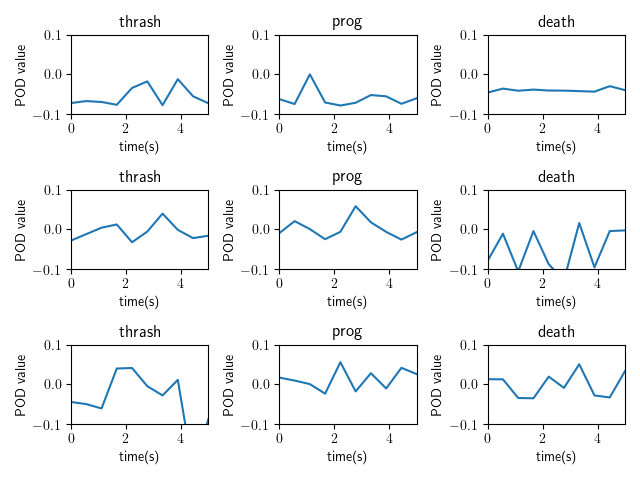

[](https://GitHub.com/Naereen/ama)


# Using Principal Component Analysis for Reduced Dimensionality and Classification of Music in Frequency Domain

This project studies applicaitons of the Singular Value Decomposition. Specifically, I used the SVD and Principal Component Analysis to study reduced dimensionality of images of people's faces. I then use the SVD to examine the principal components of music files, and then classify genres and artists with Linear Discriminant Analysis.
# Motivation

This project was originally begun to satisfy an assignment in a graduate level course in Data Science and Scientific Computing in the University of Washington's Applied Mathematics program.


# Framework

-MATLAB 2019

# Figure Examples




# Code Example
```
 %Makes a list of the directory of the folder containing the sub-folders.
S = dir(fullfile(D,'*'));

% removes the up/down dirs and makes a list of the folder names.
N = setdiff({S([S.isdir]).name},{'.','..'});

for i = 1:numel(N)
    
    T = dir(fullfile(D,N{i},'*')); %sub-folder directory
    C = {T(~[T.isdir]).name}; % files in subfolder.
    for j = 1:numel(C)
        F = fullfile(D,N{i},C{j});    
        % do whatever with file F.
        I = imread(F);
        I_col = I(:) - mean(I(:));
        cropped_master_mat = [cropped_master_mat I_col];

    end
end
```